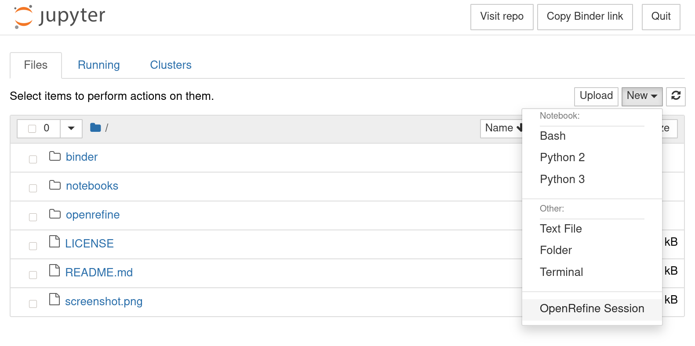

# openrefineder
💠 + 📚 OpenRefine on Binder!

Small demo of using [OpenRefine](http://openrefine.org/) on binder.
Still under 👷🚧🏗!

# Starting OpenRefine in a binder

## Quickstart

 (launch binder with option urlpath=/openrefine)

## From JupyterLab home screen

To access OpenRefine wait for the binder to launch. Then click
"New -> OpenRefine session" on the right hand side of the screen.

A new tab should open which after a few seconds will show the familiar
OpenRefine home screen.

# OpenRefine CLI

This binder also includes the [openrefine-client](https://github.com/opencultureconsulting/openrefine-client) and the [bash_kernel](https://github.com/takluyver/bash_kernel).
There is a notebook available that shows how to use the command line interface:

 (launch binder with option urlpath=/tree/openrefine-client.ipynb)

# What is OpenRefine?

OpenRefine (formerly Google Refine) is a powerful tool for working with messy data: cleaning it; transforming it from one format into another; and extending it with web services and external data.

Read more about it: http://openrefine.org/
